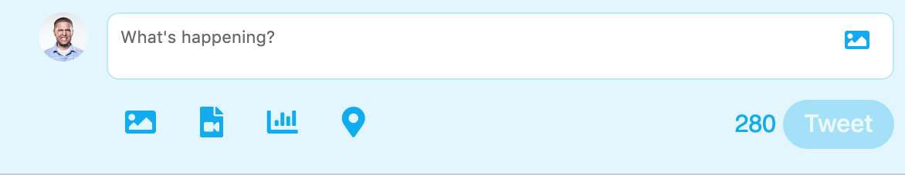
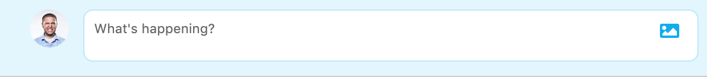
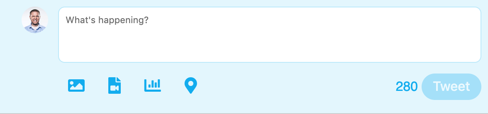
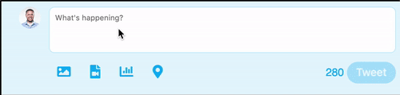
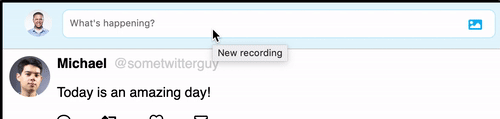
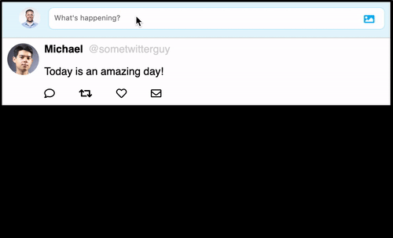

# Project Summary
---
In this project you will need to implement some user interactions for a twitter clone. This clone
isn't going to be an exact match with twitter but will be a good way to practice building interactive
user experiences. You should have had an intro to JQuery at this point, so feel free to use JQuery
to power your interactions.

## Project Objectives
The goal of this exercise is to get familiar with taking a specification and implementing the desired
functionality, this is what every software project consists of.

Because this project has very little guidance you'll need to rely on reading documentation and experimenting.
Both of these are essential skills for a software developer. You have access to the entire internet, use
that resource to help you to create solutions to the interactions you'll be building in
this project.

### Resources

[JQuery API Documentation](https://api.jquery.com/)

[MDN](https://developer.mozilla.org/en-US/)

[Stack Overflow](https://stackoverflow.com)

...plus anything else you can find :)

## Project Setup

1. Fork and clone this repository.
2. Create a git branch called `submission`.
3. This repository has a helpful test suite that you can run to see if your implementation
   is up to spec.

   > Test Suite Setup:
   >
   > 1. From the root of this repository run `npm install`. This will install all the necessary packages to run the tests.
   > 2. To run the test suite run `npm test` that will run the test suite once and then exit.
   > 3. You can run the test suite in watch mode with `npm run test:watch`.
   > 4. Reading the test can be helpful as well.

4. JQuery has been included in the `index.html` and is available if you want to utilize it for this project.
5. Familiarize yourself with the HTML and CSS that is provided.
6. Read through the directions below for the features that need to be implemented.

## Feature 1 - Tweet Input

 The first UI interaction that needs to be built is the input for writing a tweet.

 If you open up the `index.html` the input area should look like this:

 

There are a few things wrong with this:

* The tweet button is showing but the tweet input isn't focused and doesn't have any text.
* All of the other buttons shouldn't be showing either, when the input isn't focused or has no text.

Here are the requirements for this user interaction:

### Requirements - Tweet Input

1. When the user first comes to the tweet input, the buttons below the input should be hidden.

    > **Zero State (no user interaction yet)**
    >
    > 

2. When the tweet input is focused (the user clicks in the input), the input area should double in size, and the tweet button and other
   buttons should be shown. Also the image button in the input should be hidden, since the same button
   appears in the buttons that were hidden previously.

    > **Expanded State (user clicked into the input)**
    >
    > 

    In this expanded state, also notice that the tweet button is `disabled`. The user should not be
    able to send an empty tweet.

3. When a user begins to type into the input, the tweet button should become `enabled`. Also the
   character count indicator should decrement as the user types into the tweet input. When there are
   ten or less characters left the counter should turn red.

   > **Typing State**
   >
   > 

4. When a user user clicks into the input, then clicks out of the input, without typing anything, the
   input should be collapsed to its zero state again.

   > **Click out with no input**
   >
   > 

5. When the user presses the `Tweet` button the input should be cleared, the input area should go back
   to its collapsed state, and a new tweet should be added to the timeline.

   > **Submit Tweet**
   >
   > 

### Challenge Features

* Add nicely formatted time stamps for tweets when they are added to the timeline.
  > example: 1min ago, 1hr ago, 1day ago, etc....

* Add a dark mode with css and a button to toggle it on and off.

* Add a way for a user to add an image to their post.

# Finished

Create a pull request back to this repository with your solution. Be sure you make the pull-request
from your `submission` branch.
